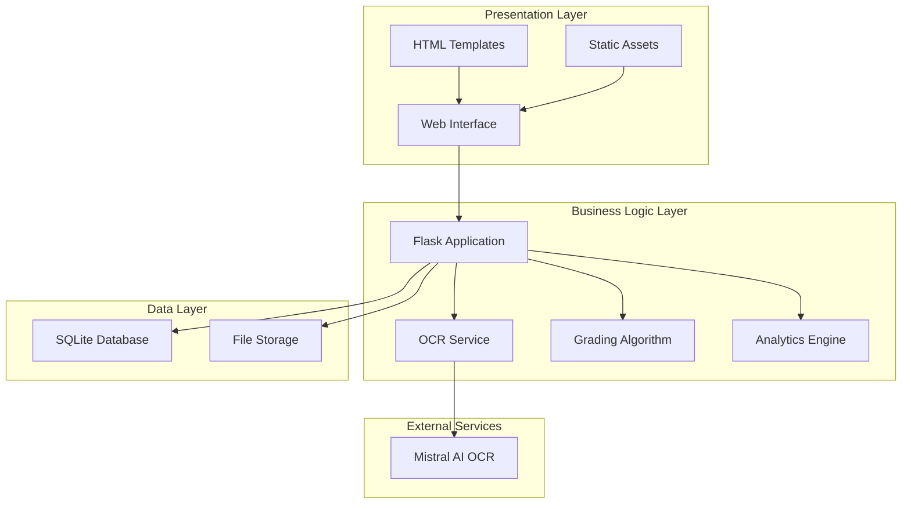

# Design Document: AI-Powered Automatic Grading System

## Overview

The AI-Powered Automatic Grading System is a Flask-based web application that automates the grading process through OCR text extraction and keyword similarity matching. The system follows a layered architecture with clear separation between presentation, business logic, and data persistence layers.

The core workflow involves: image upload → OCR text extraction → keyword similarity analysis → grade calculation → result storage → analytics visualization. The system uses Mistral AI for OCR processing, SQLite for data persistence, and provides a responsive web interface with comprehensive analytics.

## Architecture

The system follows a traditional three-tier web architecture:



**Key Architectural Principles:**
- **Separation of Concerns**: Clear boundaries between presentation, business logic, and data layers
- **Stateless Design**: Each request is independent, enabling horizontal scaling
- **External Service Integration**: Loose coupling with Mistral AI through well-defined interfaces
- **Data Persistence**: Reliable storage with SQLite for development and easy deployment

## Components and Interfaces

### Core Components

#### 1. Flask Application Controller (`app.py`)
**Responsibilities:**
- HTTP request routing and response handling
- File upload management and validation
- Orchestration of OCR and grading workflows
- Session management and error handling

**Key Methods:**
```python
def index() -> Response  # Main grading interface
def dashboard() -> Response  # Analytics dashboard
def export_csv() -> Response  # Data export functionality
```

#### 2. OCR Service Module
**Responsibilities:**
- Image preprocessing and validation
- Integration with Mistral AI OCR API
- Text extraction and cleaning
- Error handling for OCR failures

**Interface:**
```python
def extract_text_from_image(file_path: str) -> str
def encode_image(image_location: str) -> str
def clean_text(text: str) -> str
```

#### 3. Grading Algorithm Engine
**Responsibilities:**
- Keyword similarity calculation
- Grade assignment based on similarity thresholds
- Matched and missing keyword identification
- Stop word filtering

**Interface:**
```python
def calculate_grade(student_text: str, teacher_text: str) -> Tuple[float, str, List[str], List[str], int]
```

#### 4. Data Models (`models.py`)
**Responsibilities:**
- Database schema definition
- ORM mapping for result persistence
- Data validation and constraints

**Schema:**
```python
class Result:
    id: Integer (Primary Key)
    student_name: String(200)
    question_id: String(100)
    student_text: Text
    teacher_text: Text
    similarity: Float
    grade: String(4)
    marks: Integer
    matched_keywords: Text (JSON)
    missing_keywords: Text (JSON)
    timestamp: DateTime
```

#### 5. Analytics Engine
**Responsibilities:**
- Performance metrics calculation
- Data aggregation for visualization
- Time-series analysis
- Statistical computations

**Interface:**
```python
def calculate_grade_distribution(results: List[Result]) -> Dict[str, int]
def calculate_student_averages(results: List[Result]) -> List[Dict]
def generate_time_series(results: List[Result]) -> List[Dict]
```

### External Integrations

#### Mistral AI OCR Service
**Integration Pattern:** REST API with base64 image encoding
**Authentication:** API key-based authentication
**Error Handling:** Graceful degradation with user feedback
**Rate Limiting:** Handled through proper exception management

## Data Models

### Primary Entities

#### Result Entity
The central data model storing all grading information:

```python
class Result(Base):
    __tablename__ = 'results'
    
    # Primary identification
    id = Column(Integer, primary_key=True)
    
    # Student and question context
    student_name = Column(String(200), nullable=False)
    question_id = Column(String(100), nullable=False)
    
    # Text content
    student_text = Column(Text, nullable=False)
    teacher_text = Column(Text, nullable=False)
    
    # Grading results
    similarity = Column(Float, nullable=False)
    grade = Column(String(4), nullable=False)
    marks = Column(Integer, nullable=False)
    
    # Keyword analysis (stored as JSON)
    matched_keywords = Column(Text)  # JSON array
    missing_keywords = Column(Text)  # JSON array
    
    # Audit trail
    timestamp = Column(DateTime, default=datetime.utcnow)
```

### Data Relationships

Currently, the system uses a single-table design optimized for simplicity and performance. Future enhancements could introduce:
- Student entity for normalized student information
- Question entity for reusable question templates
- Subject/Course entities for organizational hierarchy

### Data Storage Strategy

**SQLite Database:**
- Single-file deployment simplicity
- ACID compliance for data integrity
- Sufficient performance for educational use cases
- Easy backup and migration

**File System Storage:**
- Uploaded images stored in `uploads/` directory
- Secure filename sanitization
- Configurable storage location
- Automatic directory creation

## Grading Algorithm Design

### Keyword Similarity Approach

The grading algorithm uses keyword-based similarity matching with the following logic:

1. **Text Preprocessing:**
   - Convert to lowercase
   - Remove special characters and extra whitespace
   - Tokenize into individual words

2. **Stop Word Filtering:**
   - Remove common words (the, a, an, and, or, etc.)
   - Focus on content-bearing keywords

3. **Similarity Calculation:**
   ```
   similarity = (matched_keywords / total_teacher_keywords) × 100
   ```

4. **Grade Assignment:**
   - A (90-100%): 100 marks
   - B (75-89%): 85 marks  
   - C (60-74%): 70 marks
   - D (40-59%): 55 marks
   - F (0-39%): 30 marks

### Algorithm Strengths
- Simple and transparent grading logic
- Fast computation suitable for real-time use
- Provides detailed feedback through keyword analysis
- Handles variations in word order and sentence structure

### Algorithm Limitations
- Does not consider semantic meaning or context
- May miss synonyms or equivalent expressions
- Sensitive to spelling variations
- Cannot evaluate logical reasoning or problem-solving approach

## Analytics and Reporting

### Dashboard Metrics

#### Grade Distribution Analysis
- Visual pie/bar charts showing A, B, C, D, F distribution
- Percentage breakdown of grade categories
- Trend analysis over time periods

#### Student Performance Tracking
- Individual student average scores
- Performance comparison across students
- Progress tracking over multiple assessments

#### Time-Series Analysis
- Daily/weekly/monthly performance trends
- Identification of improvement or decline patterns
- Class-wide performance evolution

### Export Capabilities

#### CSV Export Format
```csv
ID,Student,Question,Marks,Grade,Similarity,Timestamp
1,John Doe,Q1,85,B,78.5,2024-01-15T10:30:00
```

**Export Features:**
- Complete dataset download
- Standardized CSV format for external analysis
- UTF-8 encoding for international character support
- Timestamp formatting for data analysis tools

## Security Considerations

### Input Validation
- File type restrictions (PNG, JPG, JPEG only)
- Filename sanitization to prevent path traversal
- File size limits to prevent resource exhaustion
- SQL injection prevention through ORM usage

### Data Protection
- No sensitive personal information storage beyond names
- Local database storage (no cloud data exposure)
- Secure file upload handling
- Error message sanitization to prevent information leakage

### API Security
- Mistral AI API key protection through environment variables
- Rate limiting consideration for external API calls
- Graceful handling of API failures

## Correctness Properties

*A property is a characteristic or behavior that should hold true across all valid executions of a system—essentially, a formal statement about what the system should do. Properties serve as the bridge between human-readable specifications and machine-verifiable correctness guarantees.*

Based on the requirements analysis, the following correctness properties ensure the system behaves correctly across all valid inputs:

### Property 1: File Format Validation
*For any* uploaded file, the system should accept it if and only if it has a PNG, JPG, or JPEG extension, rejecting all other formats with appropriate error messages.
**Validates: Requirements 1.1, 1.2**

### Property 2: Secure File Storage
*For any* valid uploaded image file, the system should store it in the uploads directory with a sanitized filename that prevents security vulnerabilities.
**Validates: Requirements 1.3, 1.5**

### Property 3: File Size Validation
*For any* uploaded file exceeding reasonable size limits, the system should reject the upload to prevent resource exhaustion.
**Validates: Requirements 1.4**

### Property 4: OCR Text Extraction
*For any* valid image provided to the OCR engine, the system should either successfully extract and return cleaned text, or return a descriptive error message if extraction fails.
**Validates: Requirements 2.1, 2.2, 2.5**

### Property 5: Text Cleaning and Normalization
*For any* extracted text containing special characters, the system should clean and normalize it by removing special characters, converting to lowercase, and normalizing whitespace.
**Validates: Requirements 2.3**

### Property 6: Comprehensive Grade Assignment
*For any* student and reference answer pair, the system should calculate similarity percentage and assign grades according to the defined scale: A (90-100%), B (75-89%), C (60-74%), D (40-59%), F (0-39%) with corresponding marks.
**Validates: Requirements 3.1, 3.2, 3.3, 3.4, 3.5, 3.6**

### Property 7: Keyword Analysis
*For any* student and reference answer comparison, the system should correctly identify matched keywords (present in both) and missing keywords (present in reference but not student), excluding stop words from the analysis.
**Validates: Requirements 3.7, 3.8, 3.9**

### Property 8: Complete Result Storage
*For any* completed grading operation, the system should store all result data (student name, question ID, texts, similarity, grade, marks, keywords, timestamp) in the database or handle storage errors gracefully.
**Validates: Requirements 4.1, 4.2, 4.3, 4.5**

### Property 9: Analytics Calculations
*For any* set of stored results, the system should correctly calculate student averages, time-series performance data, and class performance metrics.
**Validates: Requirements 5.2, 5.3, 5.6**

### Property 10: Complete CSV Export
*For any* dataset export request, the system should generate a CSV file containing all required fields (ID, student, question, marks, grade, similarity, timestamp) or provide appropriate error feedback if export fails.
**Validates: Requirements 6.1, 6.2, 6.4, 6.5**

### Property 11: Keyword Feedback Display
*For any* grading result, the system should display matched keywords and missing keywords with a maximum limit of 15 each to prevent information overload.
**Validates: Requirements 7.1, 7.2, 7.3**

### Property 12: Low Score Warning System
*For any* grading result with similarity below 40%, the system should display a warning recommending manual review.
**Validates: Requirements 8.1**

### Property 13: Input Validation and Error Handling
*For any* user input with missing required fields or invalid data, the system should display specific validation errors and maintain application stability.
**Validates: Requirements 8.2, 8.3, 10.1, 10.4, 10.5**

### Property 14: Security Validation
*For any* user input or file upload, the system should validate and sanitize data to prevent SQL injection and other security vulnerabilities, enforcing appropriate security restrictions.
**Validates: Requirements 10.2, 10.3**

### Property 15: Result Display Completeness
*For any* grading result display, the system should present all relevant information including student name, question ID, similarity score, grade, marks, and keyword feedback in an organized format.
**Validates: Requirements 9.2**

## Error Handling

### Error Categories and Responses

#### File Upload Errors
- **Invalid file format**: Clear message specifying accepted formats (PNG, JPG, JPEG)
- **File too large**: Message indicating size limit exceeded
- **Upload failure**: Generic upload error with retry suggestion
- **Missing file**: Validation error requesting file selection

#### OCR Processing Errors
- **Text extraction failure**: Suggestion to use clearer image or different format
- **API connection error**: Temporary service unavailability message
- **Invalid image content**: Message indicating unreadable or corrupted image

#### Database Errors
- **Connection failure**: Temporary database unavailability message
- **Storage error**: Data persistence failure with retry option
- **Query error**: Generic database error with support contact

#### Validation Errors
- **Missing reference answer**: Specific field validation message
- **Invalid student name**: Format requirements explanation
- **Invalid question ID**: Format requirements explanation

### Error Recovery Strategies

#### Graceful Degradation
- Continue operation when non-critical features fail
- Provide alternative workflows when primary features unavailable
- Maintain data integrity during partial failures

#### User Feedback
- Clear, actionable error messages
- Specific guidance for error resolution
- Progress indicators for long-running operations

#### System Stability
- Exception handling prevents application crashes
- Resource cleanup after errors
- Logging for debugging and monitoring

## Testing Strategy

### Dual Testing Approach

The system requires both unit testing and property-based testing for comprehensive coverage:

**Unit Tests:**
- Specific examples demonstrating correct behavior
- Edge cases and boundary conditions
- Integration points between components
- Error conditions and exception handling

**Property-Based Tests:**
- Universal properties verified across randomized inputs
- Comprehensive input coverage through generation
- Validation of correctness properties defined in this document
- Minimum 100 iterations per property test

### Property-Based Testing Configuration

**Framework Selection:** Use `hypothesis` for Python property-based testing
**Test Configuration:**
- Minimum 100 iterations per property test
- Custom generators for domain-specific data (student texts, file types, etc.)
- Shrinking enabled for minimal failing examples
- Deterministic seeds for reproducible test runs

**Test Tagging Format:**
Each property test must include a comment referencing the design document property:
```python
# Feature: ai-grading-system, Property 1: File Format Validation
```

### Testing Coverage Areas

#### Core Functionality Testing
- OCR text extraction with various image types and qualities
- Grading algorithm with diverse text combinations
- Database operations with different data scenarios
- File upload handling with various file types and sizes

#### Integration Testing
- End-to-end grading workflow
- Dashboard analytics with different datasets
- CSV export with various result sets
- Error handling across component boundaries

#### Security Testing
- Input validation with malicious inputs
- File upload security with dangerous file types
- SQL injection prevention
- XSS prevention in user inputs

#### Performance Testing
- Large dataset handling for analytics
- Concurrent user scenarios
- Memory usage with large file uploads
- Database query performance with large result sets

### Test Data Management

#### Generated Test Data
- Random student and teacher text pairs
- Various image file types and sizes
- Different student name and question ID formats
- Diverse grading result datasets

#### Edge Case Coverage
- Empty or minimal text inputs
- Maximum length text inputs
- Special characters and Unicode text
- Boundary similarity scores (exactly 40%, 60%, 75%, 90%)

#### Error Condition Testing
- Network failures for OCR API
- Database connection failures
- File system permission errors
- Invalid file formats and corrupted images